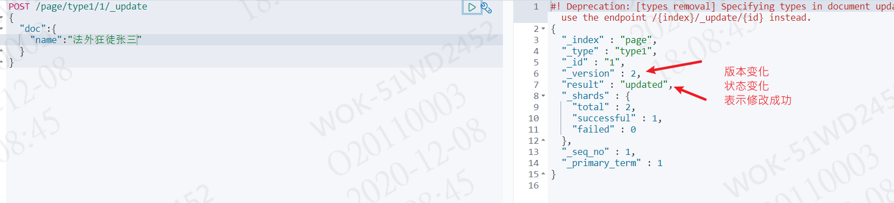

## elasticsearch

> 华为云下载elasticsearch、logstash、kibana （注意ELK版本要一致）

```
 https://mirrors.huaweicloud.com/elasticsearch/?C=N&O=D
logstash: https://mirrors.huaweicloud.com/logstash/?C=N&O=D
kibana: https://mirrors.huaweicloud.com/kibana/?C=N&O=D
```


> 插件 head

```
地址： https://github.com/mobz/elasticsearch-head
```


> ik 下载地址:https://github.com/medcl/elasticsearch-analysis-ik/releases
>
> 


## elasticsearch 访问地址

http://localhost:9200/

出现这种访问成功


> 因UI 界面的端口是9100存在跨域问题需要设置跨域访问

```yaml
http.cors.enabled: true #开启跨域
http.cors.allow-origin: "*" #所有人都可以访问
```


## 运行head界面化elasticsearch

> npm run start 运行 


> 访问成功


可以把索引看作一个数据库


## Kibana

设置中文  kibana-7.8.0-windows-x86_64\kibana-7.8.0-windows-x86_64\config

i18n.locale: "zh-CN"  最后一行填入

> 运行Kibana

kibana-7.8.0-windows-x86_64\kibana-7.8.0-windows-x86_64\bin\kibana.bat


启动成功访问： http://localhost:5601/


## elasticsearch 核心概念

> elasticsearch 是面向文档


**物理是设计：**

elasticsearch 在后台把每个索引划分成多个分片，每份分片可以在集群中的不用服务器间迁移

一个人就是一个集群！默认集群名称就是elasticsearch


## 安装IK分词器

> 下载IK分词器  ： https://github.com/medcl/elasticsearch-analysis-ik/releases/tag/v7.8.0


> 放入到指定文件夹中


> 分词器可分为细粒度：ik_smart、粗粒度：ik_max_word


> 配置自己的分词器字典


## 关于索引

> restful风格说明


> PUT 添加一个索引


成功插入


> 创建文档


创建成功并声明类型

同是PUT同一个ID 会被覆盖，同时版本号会改变，状态也会改变


> GET 

不声明类型es会自己推断类型。page是es推断的，test1是自己指定的


text类型在存储数据的时候会默认进行分词，并生成索引。而keyword存储数据的时候，不会分词建立索引，显然，这样划分数据更加节省内存。

  这样，我们映射了某一个字段为keyword类型之后，就不用设置任何有关分词器的事情了，该类型就是默认不分词的文本数据类型。而对于text类型，我们还可以设置它的分词类型

> POST 命令      POST/索引/类型/id/_update




> DELETE 命令     DELETE/索引/类型/id

删除命令写到索引就删除索引，写到类型就删除索引下类型，id同理

## 关于文档

> 复杂查询


> 指定字段查询


> 排序


> 分页


> 多条件查询

must（and）： 所有条件都要匹配

must_not(!=) : 不符合条件的

should（or）： 两条件满足一个


> 过滤数据


> 匹配多个条件


> 精确查询 term

是直接通过倒排索引指定的词条进行精确的查找


text，keyword区别

text:可以被分词器解析 例如：中国家   中国  国家

keyword： 不可以被分词器解析 


> 高亮查询


自定义高亮标签


## Springboot集成Elasticsearch

> 引入maven依赖  版本要一致

```xml
		<dependency>
			<groupId>org.springframework.boot</groupId>
			<artifactId>spring-boot-starter-data-elasticsearch</artifactId>
		<!--<version>${elasticsearch.version}</version>-->
		<dependency>
```

> 编写配置类

```java
package com.page.elasticsearchapi.config;

import org.apache.http.HttpHost;
import org.elasticsearch.client.RestClient;
import org.elasticsearch.client.RestHighLevelClient;
import org.springframework.context.annotation.Bean;
import org.springframework.context.annotation.Configuration;

@Configuration
public class ElasticSearchConfig {

    @Bean
    public RestHighLevelClient  restHighLevelClient (){
        RestHighLevelClient client = new RestHighLevelClient(
                RestClient.builder(
                        new HttpHost("127.0.0.1", 9200, "http")));
        return client;
    }
}

```

> 创建索引

```java
@Resource
	private RestHighLevelClient client;

	//创建索引
	@Test
	void index() throws IOException {
		//创建索引请求
		CreateIndexRequest request = new CreateIndexRequest("page1");
		//客户端执行请求 indicesClient ,请求后获得相应                   请求      请求参数
		CreateIndexResponse response = this.client.indices().create(request, RequestOptions.DEFAULT);
		System.out.println(response);
	}

```

> 获取索引

```java
//获取索引  只能判断是否存在
	@Test
	void getIndex() throws IOException {
		//创建获取索引请求
		GetIndexRequest request = new GetIndexRequest("page1");
		//判断索引是否存在
		boolean exists = this.client.indices().exists(request, RequestOptions.DEFAULT);
		System.out.println(exists);
	}
```

> 删除索引

```java
//删除索引
	@Test
	void delIndex() throws IOException {
		//创建删除索引请求
		DeleteIndexRequest request = new DeleteIndexRequest("page1");
		//删除索引
		AcknowledgedResponse response = this.client.indices().delete(request, RequestOptions.DEFAULT);
		//删除返回true
		System.out.println(response.isAcknowledged());
	}
```

> 创建文档

```java
//测试创建文档
	@Test
	void addDocument() throws IOException {
		User user = new User("张三",2);
		//创建请求
		IndexRequest request = new IndexRequest("page1");
		//id、
		request.id("1");

		//将数据放入请求中
		request.source(JSON.toJSONString(user), XContentType.JSON);

		//发送请求获取响应
		IndexResponse response = this.client.index(request, RequestOptions.DEFAULT);
		//IndexResponse[index=page1,type=_doc,id=1,version=1,result=created,seqNo=0,primaryTerm=1,shards={"total":2,"successful":1,"failed":0}]
		System.out.println(response.toString());
		//创建成功返回CREATED
		System.out.println(response.status());
	}
```

> 获取文档内容

```java
//获取文档id为1的内容
	@Test
	void getDocument() throws IOException {
		GetRequest request = new GetRequest("page1","1");
		boolean exists = this.client.exists(request, RequestOptions.DEFAULT);
		if(exists){
			GetResponse response = this.client.get(request, RequestOptions.DEFAULT);
			System.out.println(response.getSourceAsString());//打印文档内容
			System.out.println(response);//打印所有内容
		}
	}
```

> 修改文档内容	

```java
//修改文档
	@Test
	void updateDocument() throws IOException {
		UpdateRequest request = new UpdateRequest("page1","1");
		User user = new User("page",24);
		request.doc(JSON.toJSONString(user),XContentType.JSON);

		UpdateResponse response = this.client.update(request, RequestOptions.DEFAULT);

		System.out.println(response);
		//获取状态成功返回ok
		System.out.println(response.status());
	}
```

> 删除文档内容

```java
//删除文档
	@Test
	void deleteDocument() throws IOException {
		DeleteRequest request = new DeleteRequest("page1","1");
		DeleteResponse response = this.client.delete(request, RequestOptions.DEFAULT);
		//成功返回ok
		System.out.println(response.status());
		System.out.println(response);
	}
```

> 批量插入

```java
//批量插入
	@Test
	void bulkDocument() throws IOException {
		//批量请求
		BulkRequest request = new BulkRequest("page1");
		ArrayList<User> list = new ArrayList<>();
		list.add(new User("sss",2));
		list.add(new User("sss",2));
		list.add(new User("sss",2));
		list.add(new User("sss",2));
		for (User user: list) {
			request.add(new IndexRequest("page1")
					.source(JSON.toJSONString(user),XContentType.JSON));
		}
		BulkResponse response = this.client.bulk(request, RequestOptions.DEFAULT);
		System.out.println(response.isFragment());//是否插入失败 返回false说明成功

	}
```

> 查询

```java
//条件查询
	@Test
	void searchDocument() throws IOException {
		//创建搜索请求
		SearchRequest request = new SearchRequest("page1");
		//构建搜索条件
		SearchSourceBuilder sourceBuilder = new SearchSourceBuilder();
		//查询条件通过QueryBuilders来实现   termQuery（）精确  matchAllQuery() 匹配 所有
		TermQueryBuilder termQueryBuilder = QueryBuilders.termQuery("name", "sss");
		//加入构造搜索条件
		sourceBuilder.query(termQueryBuilder);
		//加入搜索请求
		request.source(sourceBuilder);

		//搜索并返回相应
		SearchResponse response = this.client.search(request, RequestOptions.DEFAULT);

		for (SearchHit hit : response.getHits().getHits()) {
			System.out.println(hit.getSourceAsMap());
		}
	}
```

> 高亮查询
>
> ```java
> //高亮查询
> @Test
> 	void searchDocument() throws IOException {
> 		//创建搜索请求
> 		SearchRequest request = new SearchRequest("page1");
> 		//构建搜索条件
> 		SearchSourceBuilder sourceBuilder = new SearchSourceBuilder();
> 		//查询条件通过QueryBuilders来实现   termQuery（）精确  matchAllQuery() 匹配 所有
> 		TermQueryBuilder termQueryBuilder = QueryBuilders.termQuery("name", "sss");
> 		//加入构造搜索条件
> 		sourceBuilder.query(termQueryBuilder);
> 		//高亮查询
> 		HighlightBuilder highlightBuilder = new HighlightBuilder();
> 		highlightBuilder.preTags();//前缀
> 		highlightBuilder.postTags();//后缀
> 		highlightBuilder.field("title");//要高亮字段
> 		highlightBuilder.requireFieldMatch(false);//所有都高亮
> 
> 		sourceBuilder.highlighter(highlightBuilder);
> 
> 		//加入搜索请求
> 		request.source(sourceBuilder);
> 
> 
> 		//搜索并返回相应
> 		SearchResponse response = this.client.search(request, RequestOptions.DEFAULT);
> 		ArrayList<Map> list = new ArrayList<>();
> 		for (SearchHit hit : response.getHits().getHits()) {
> 			//获取高亮Map
> 			Map<String, HighlightField> highlightFields = hit.getHighlightFields();
> 			//获取高亮的属性
> 			HighlightField title = highlightFields.get("title");
> 			Map<String, Object> hitSourceAsMap = hit.getSourceAsMap();
> 			String n_title ="";
> 			//替换hit里的title变成高亮
> 			if(title!=null){
> 				for (Text text : title.fragments()) {
> 					n_title+=text;
> 					hitSourceAsMap.put("title",n_title);
> 				}
> 			}
> 			list.add(hitSourceAsMap);
> 		}
> 	}
> ```
>
> 

